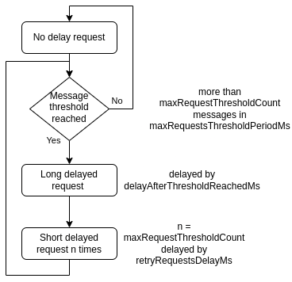

# Fleet HTTP client

A simple wrapper for a c++ rest API client generated by the [OpenAPI Generator](https://openapi-generator.tech). Simplifies functions used to call endpoints of the API. Also limits the amount of requests in case of an error which may cause the API to not wait for new statuses/commands. 

### Request frequency limit

Is only used on getCommands and getStatuses functions. Each time these functions get called, the current time gets added to a container which is then analyzed to find out whether there are too many requests. This needs to be configured by 4 parameters:

- `maxRequestsThresholdCount` max amount of allowed requests in the specified time period, default: 3

- `maxRequestsThresholdPeriodMs` time period in which the amount of requests is checked, default: 1000

- `delayAfterThresholdReachedMs` time to sleep for in ms when threshold is initially reached, default: 500

- `retryRequestsDelayMs` delay in ms between requests until request rate is no longer over the threshold, default: 220 (this value should be lower than `maxRequestsThresholdPeriodMs` / `maxRequestsThresholdCount` otherwise the threshold will never be reached a second time; 220 was chosen as the above calculation lowered by an additional third of the delay to account for additional delays created by communication)

After the initial threshold delay ends, the time container is emptied and subsequent requests are delayed for a shorter time. If the threshold is no longer reached afterwards, the following requests work without any delay as originally.

## Usage

When using fleet-http-client, it is required to install its dependencies. 
This has to be done because cpprest is obsolete.

### Requirements

- cpprestsdk
- Boost

All requirements can be added by bringauto Packager

### Example

Usage example is in [Mission module CMakeLists](https://github.com/bringauto/mission-module/blob/master/CMakeLists.txt). 
Pay attention to the FIND_PACKAGE part.

## Generating client code

To regenerate the Cpp-rest-openapi-client lib, use the `regen.sh` script. [Information on how to run the script](./openapi/README.md).

## Tests

[Tests Readme](./test/README.md)
